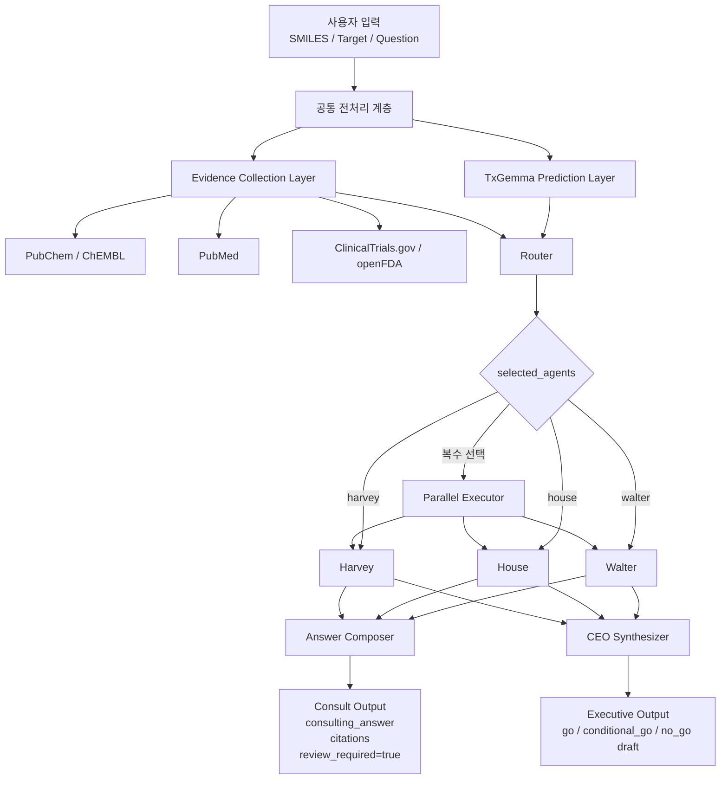
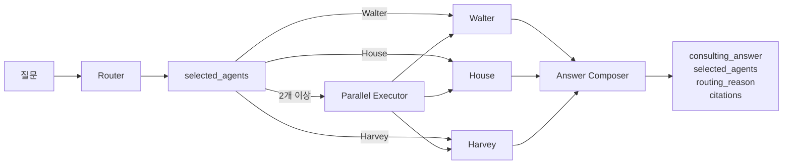
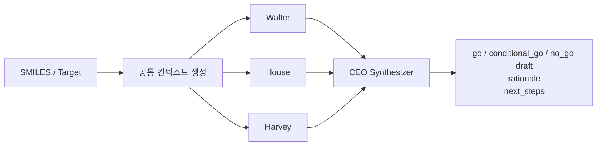
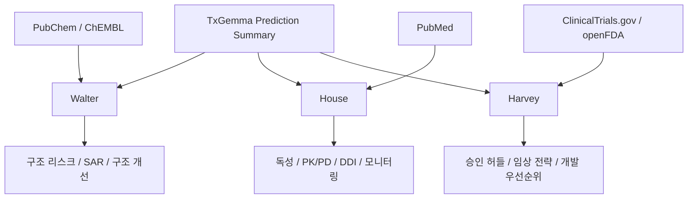
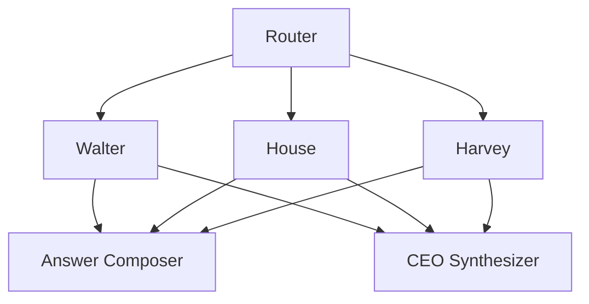

# Agent 구조 시각화

## 전체 Agent 구조

## Consult 흐름

## Executive 흐름

## Agent별 데이터 의존성

## 단순 역할 관계

## 사용 원칙

- 이 문서는 agent topology와 역할 관계를 설명합니다.
- 모듈 경계와 전체 런타임 데이터 흐름은 `architecture_overview_ko.md`에서 확인합니다.
- Agent를 추가, 제거, 병합하거나 호출 흐름을 바꾸면 이 문서와 `AGENTS.md`를 함께 업데이트합니다.
