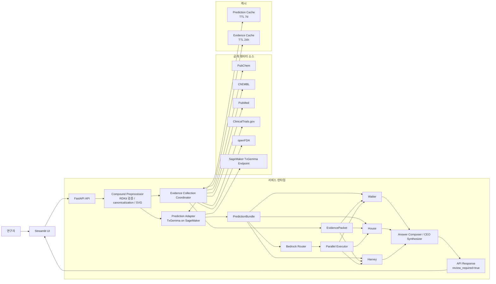
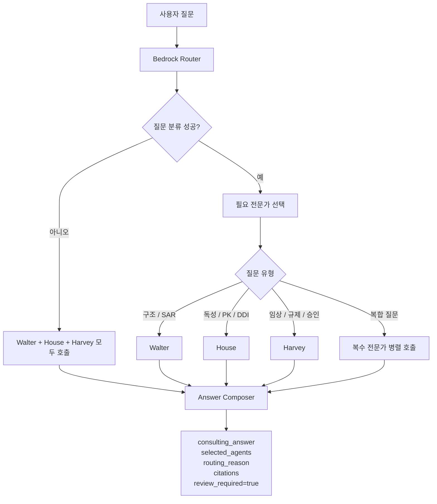
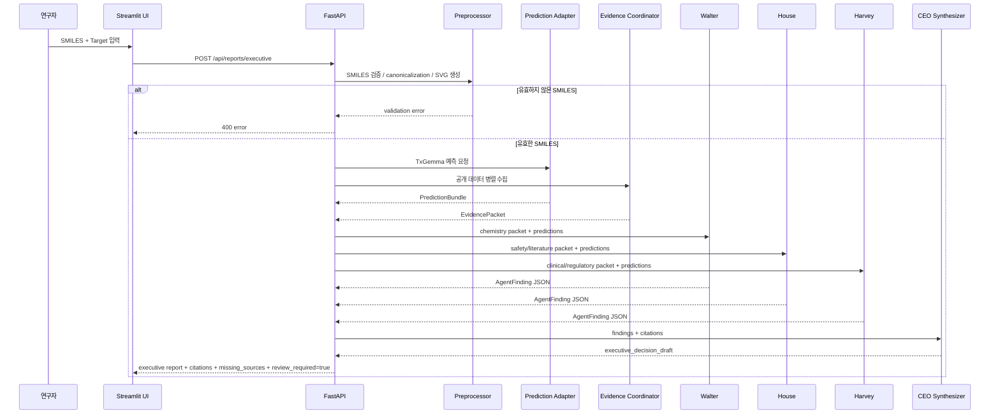
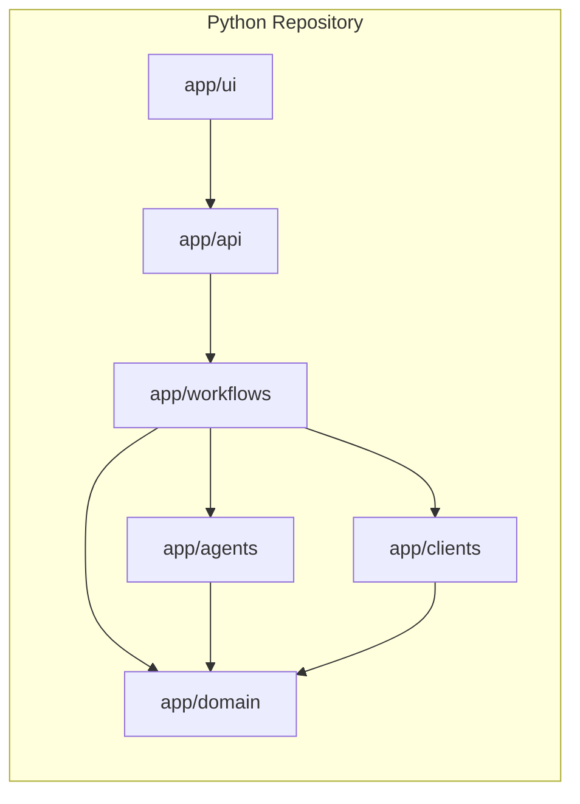

# Agentic AI 신약개발 PoC 전체 아키텍처 시각화

## 시스템 개요

## 스마트 컨설팅 흐름

## 종합 분석 흐름

## 모듈 경계

## 문서 사용 원칙

- 이 문서는 목표 상태 아키텍처를 설명합니다.
- 실제 진행 상태는 `architecture_progress_checklist_ko.md`에서 관리합니다.
- 구조 변경 시 이 문서와 `AGENTS.md`를 함께 업데이트합니다.
